# Building your MVP with Cursor

Session 2

How to take your MVP from idea to working prototype with Cursor. 

---

# About Me

#### **Sanjeed** · AI Engineer

- AI Consultant for startups across US (YC startups), UK, India. 
- Cursor India Ambassador.
- IIT Madras -> Built startup in college -> PM (US Fintech, AI) -> AI Engineer. 
- Specialize in building AI agents that work - focus on evals. 
- More about me: [sanjeed.in](https://www.sanjeed.in/)
- Feel free to connect on [X](https://x.com/sanjeed_i) or [LinkedIn](https://www.linkedin.com/in/msanjeed/).

---

# Agenda

- Review the PRD and Plan from last session 
- Build MVP with Cursor while exploring Cursor features

---

# Why Cursor instead of other vibe coding tools?

- **Human-AI collaboration**: Your role is reviewing code and unblocking the AI when it gets stuck
- **Project context**: Unlike black-box tools, you maintain full context to help when the AI gets stuck
- **Context degradation**: You can see the context degradation and fix it. With other tools, you don't know what's going on.
- **Choose Best Models**: You can choose the best models for your task. Most tools don't give you this option.

**Bottom line**: Vibe coding tools are great for simple sites and MVPs, but Cursor gives you the power and control needed for sophisticated MVPs.

**Pro Tip**: Start with v0/lovable etc. to build your UI and then use Cursor to build the rest. 

---

# Session 1 Quick Recap

- **MVP**: Minimum Viable Product - smallest version that delivers real value, validates the riskiest assumption, optimizes for learning speed
- **Principles**:
  - Solve one core job very well
  - Cut scope aggressively
  - Leverage existing tools, frameworks, libraries, templates
  - Ignore scale now, validate quickly
- **Tips**:
  - Create plan with iterative milestones
  - Ask AI to clarify before making plans
- **Outcomes**: `PRD.md` and `plan.md` ready for today’s build

---

# AI-Assisted Development: The new workflow

- **A major shift**: Models now grasp entire codebases and can plan and complete multi-step tasks.
- **Maturity levels**:
  - Level 0: You write every line
  - Level 1: Autocomplete tools (Copilot, Cursor)
  - Level 2: AI creates functions from descriptions
  - Level 3: AI builds features from specifications
  - Level 4: AI agents run full workflows
- **Updated workflow**: Think → Prompt → Verify → Iterate → Deploy
- **Level 4 is possible now**, given you give the right context. 
- **Mindset**: Treat AI as a fast, capable junior. Give direction, review outputs, and refine.

---

# Setup your environment

- Install Cursor 
- Install node.js and pnpm 
- Open Cursor
- Click Clone Repo
- Enter URL: https://github.com/sanjeed5/nextjs-ai-starter
- In Terminal: `pnpm i` then `pnpm dev`
- Open the localhost URL in your browser

---

# Build MVP with Cursor

- Let's build the AI Task Manager we defined in the PRD. 
- We will use Cursor to accelerate the process, from planning to implementation.

---


# Choosing Models


- **Choose intentionally**:
  - Simple tasks: prefer fast models
  - Complex reasoning: prefer frontier models

--

<Grid2x2
  :row-labels='["Smartest", "Smart"]'
  :col-labels='["Slower", "Faster"]'
  :width="720"
  :height="360"
  :header-width="160"
  :cells='[
    ["GPT-5", "Ideal Model (doesnt exist yet)"],
    ["Claude 4 (not thinking)", "Gemini 2.5 Flash"]
  ]'
/>
---

# Creating the PRD

- **Goal**: Define the product requirements for our AI Task Manager.
- **Action**: Use "Chat" to generate a PRD.
```md
**Prompt**: "Help me create a simple PRD.md to create an AI task manager app. Keep it very minimal and MVP focused. I am thinking a list with tasks to do. And then an AI action button which can break down tasks for me. And another button which will help me plan my day. Let's just focus on the flow now."
```

- **Tip**: Use ChatGPT or Google AI Studio or Claude to generate the PRD to save Cursor credits if needed.

---

# Creating the Implementation Plan

- **Goal**: Create a technical plan to build the MVP.
- **Tip**: The AI can help you think through problems. By asking it to identify key questions, you can create a more robust plan. Choose a reasoning model for this. 

```md
Prompt template:
Create a concise plan for prd.md. Include:
- Purpose and success criteria
- Tech stack and invariants
- 3 to 4 milestones (independent, no timelines)
- Open questions

Before you start, ask any clarifying questions first. 
```
---

# Context is King

- Add context with @Files and @Folders
- Use `@` to add `@prd.md`, `@plan.md`, or `@src/components` into prompts
- Drag files or folders into Chat to include them or CMD+L
- Cursor condenses large files automatically to fit context

[Docs: @ Symbols](https://docs.cursor.com/en/context/@-symbols/overview)

---


# Context Degradation

- Long conversations can dilute attention to earlier details even before you reach the hard context limit
- Symptoms:
  - The model repeats a mistake you already fixed
  - Important constraints from earlier get ignored
  - Replies drift or contradict prior decisions
- Evidence from long-context benchmarks shows accuracy can drop as input grows very large
- What to try first when mistakes repeat:
  - Start a fresh chat and restate the current state and constraints
  - Keep only the essentials in the new thread

---

# Context Management

- Goal: include enough to solve the task, not everything you have

- When to start fresh:
  - Switching features or topics
  - After several dead ends or growing confusion
  - When the context meter is high or you see degradation signals
- Cursor tips:
  - Watch the context gauge
  - Auto-condense helps, but it is lossy, so summarize key details yourself when precision matters

---


# Leverage Cursor Rules

Control AI behavior with reusable, scoped instructions.

- **Project Rules**: `.cursor/rules`, version-controlled and scoped
- **User Rules**: Global preferences in Settings
- Create via "New Cursor Rule" or `Settings > Rules`
- Write in MDC with metadata and content
- Reference files with `@filename.ts`

Example `ui-components.mdc`:

```md
---
description: Implementing designs and building UI
globs: ["**/components/**"]
---
- Reuse components from `/src/components/ui`
- Compose primitives when new UI is required
```

[Docs: Cursor Rules](https://docs.cursor.com/en/context/rules)

---

# Cursor Rule Types and Best Practices

- **Rule application types**:
  - Always: included in all contexts
  - Auto Attached: attaches when matched files are referenced
  - Agent Requested: AI may include it if helpful
  - Manual: include with `@ruleName`

- **Best practices**:
  - Keep rules short and focused
  - Provide concrete examples or referenced files
  - Split large themes into multiple rules
  - Use `/Generate Cursor Rules` from chat to capture decisions

---

# Cursor Agent Modes

- **Agent**: Autonomous exploration and multi-file edits
- **Ask**: Read-only exploration, explains without changing files
- **Manual**: Precise, targeted edits on selected files only
- **Custom**: Define your own workflow and tool access

**Try creating a Teach mode (custom)**
- Always teaches first: explains what it will do, why, and tradeoffs before any action
- Teach only variant: never edits or runs commands, only explains and instructs
- Great for learning, code reviews, and pairing with step-by-step guidance

Docs: [Agent Modes](https://docs.cursor.com/en/agent/modes#debug)

---

# Visualize the architecture with Mermaid

**Prompt**: "Generate a Mermaid diagram for this MVP showing UI, state, storage, and LLM calls". See [Architectural diagrams](https://docs.cursor.com/en/guides/tutorials/architectural-diagrams).

```mermaid
graph TD
    subgraph "User"
        actor["👤 User"]
    end

    subgraph "Browser"
        UI("⚛️ TaskManager Component")
        State("🔄 React State")
        Storage("💾 localStorage")
    end

    subgraph "Backend API"
        BreakdownAPI("/api/breakdown")
        PlanDayAPI("/api/plan-day")
    end

    subgraph "AI Service"
        Gemini("✨ Google Gemini")
    end

    actor -- "Manages Tasks" --> UI
    UI -- "Updates" --> State
    State -- "Persists" --> Storage

    UI -- "Clicks 'Subtask with AI'" --> BreakdownAPI
    BreakdownAPI -- "Calls AI" --> Gemini
    Gemini -- "Returns Subtasks" --> BreakdownAPI
    BreakdownAPI -- "Streams response" --> UI

    UI -- "Clicks 'Plan My Day'" --> PlanDayAPI
    PlanDayAPI -- "Calls AI with tasks" --> Gemini
    Gemini -- "Returns Markdown Plan" --> PlanDayAPI
    PlanDayAPI -- "Streams response" --> UI
    
    UI -- "Clicks 'Clear Plan'" --> State
```



---

# Optional - connect external tools for even more context

- Context7 MCP - for updated docs
- Browser Tools MCP: monitor console and network logs from Cursor
- Figma Dev Mode MCP: pull measurements and assets directly in Cursor
- Linear MCP: browse issues and plan tasks without leaving the editor

Links:
- [Web Development guide](https://docs.cursor.com/en/guides/tutorials/web-development)
- [Browser tools setup](https://browsertools.agentdesk.ai/installation)

---

# Key Takeaways

- **Context is King**: Use `@` to reference files, docs and give the AI maximum context.
- **Reuse & Rules**: Reuse components and add short rules to guide consistent outputs.
- **Tight Feedback Loops**: Bootstrap in Chat, iterate with Cmd+K and Tab, verify in the browser.
- **AI as a Partner**: Leverage the AI to brainstorm, plan, review code, and write docs.
- **Focus on Building**: Let the AI handle boilerplate so you can focus on decisions and quality.

